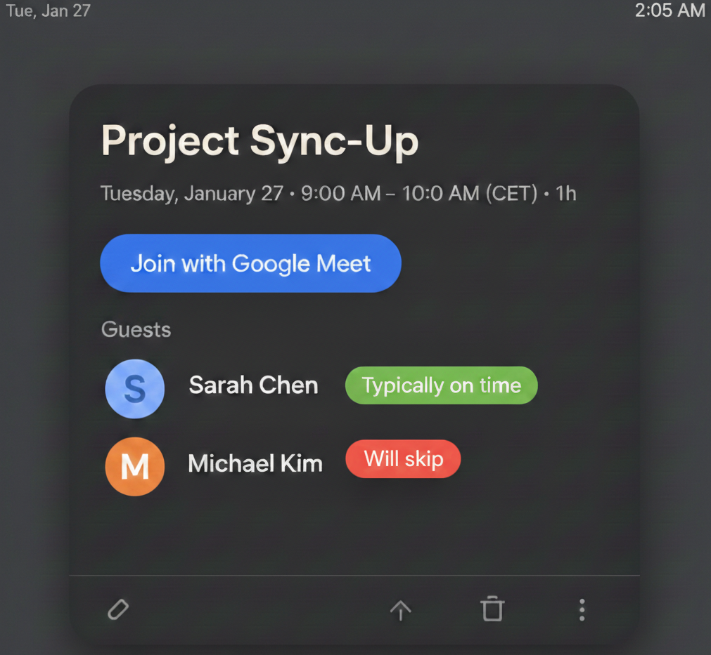

# Lateness Estimator for Google Calendar

Lateness Estimator is a tiny Chrome extension that sneaks into Google Calendar event dialogs and adds little chaos-badges next to attendee names.

It does not know who is actually late.
It does not read anyone's soul.
It just gives your meetings the kind of commentary they probably deserve.

  

## What it does
- Adds funny lateness chips next to attendee names inside the full Google Calendar event dialog.
- Generates labels like `Espresso delay +8m`, `Shockingly on time`, `Skipping, blaming traffic`, or `On time, somehow`.
- Colors chips on a soft green → yellow → red scale depending on how cursed the fictional arrival estimate is.
- Lets you manually edit any chip if the generated lie is not the lie you wanted.
- Gives you a `Reroll labels` button so you can reshuffle the vibes for the current event without reloading the page.
- Avoids attaching chips to random calendar furniture like rooms, attachments, and other non-human things.

## Quick usage
1. Open a Google Calendar event (full event details dialog).
2. Watch the attendee list become judgmental.
3. Click a chip to edit it.
4. Click `Reroll labels` if the current batch is not dramatic enough.

## Modes
You can pick how rude or restrained the extension should be from the options page.

- `Playful` : light chaos
- `Savage` : sharper nonsense
- `Professional` : suspiciously polite
- `Minimal` : short and dry

Open it from the extension details page in `chrome://extensions`, or via the extension's options page once loaded.

## Privacy & data
- No data leaves your browser.
- Manual label edits are stored locally in `chrome.storage.local` under `lateManualLabels`.
- Extension settings are stored locally under `lateSettings`.
- Generated labels are not persisted forever; they are meant to be rerolled, not archived like evidence.
- Email domains are stripped and identifiers are masked before storage lookups.

## Installation (developer / local)
1. Open `chrome://extensions` in Chrome.
2. Enable "Developer mode".
3. Click "Load unpacked" and select the extension folder (this repository root).
4. Reload the extension after making changes while developing.

## Configuration & Behavior
- Labels reshuffle on page reload.
- `Reroll labels` reshuffles only the current event.
- Manual edits override generated labels and stay put until you change them again.
- Chips are displayed inline next to attendee names so they read like part of the guest row, not a detached weather report.

## Limitations
- Chips are injected in the full event details dialog.
- If Google Calendar changes its DOM, selector updates may be required.
- The extension is playful, not prophetic.

## Reset stored labels
- To clear saved labels, open DevTools on any page and run:
  - `chrome.storage.local.remove('lateManualLabels')`
  - `chrome.storage.local.remove('lateSettings')`

## Files of interest
- `src/contentScript.js` — entry point that initializes the observer
- `src/observer.js` — detects event dialogs and triggers processing
- `src/LabelModel.js` — attendee extraction, deduplication, session state
- `src/ui.js` — chip creation, label generation, reroll behavior, and edit popover
- `src/storage.js` — storage wrapper that messages the background worker
- `src/background.js` — service worker handling storage messages
- `src/styles.css` — chip styling, alignment, and motion
- `options/` — mode selection UI

## Troubleshooting
- If chips don't appear, reload the extension in `chrome://extensions` and reopen the event dialog.
- If reroll seems stuck, make sure the event dialog is still the full details view and not a tiny hover surface.
- If you manually edited a label and reroll does nothing for that person, that is expected: manual overrides win.

## FAQ
**Is it secure?**  
This extension runs only in the Google Calendar page context and uses Chrome's built-in storage APIs. It does not send data to any server.

**What about data privacy?**  
All labels are stored locally in `chrome.storage.local`, and email domains are stripped/masked before storage. Nothing is transmitted off-device.

**Is the lateness data real?**  
Absolutely not. This extension is basically decorative slander.

**Can I choose the tone?**  
Yes. Use the options page and pick `Playful`, `Savage`, `Professional`, or `Minimal`.

**Can I reroll a meeting without refreshing the page?**  
Yes. Use the `Reroll labels` button inside the event dialog.

## License & Disclaimer
This project is provided as-is for fun, experimentation, and making meetings feel slightly less sterile. It does not track real attendance behavior and should not be treated like a forensic instrument.
